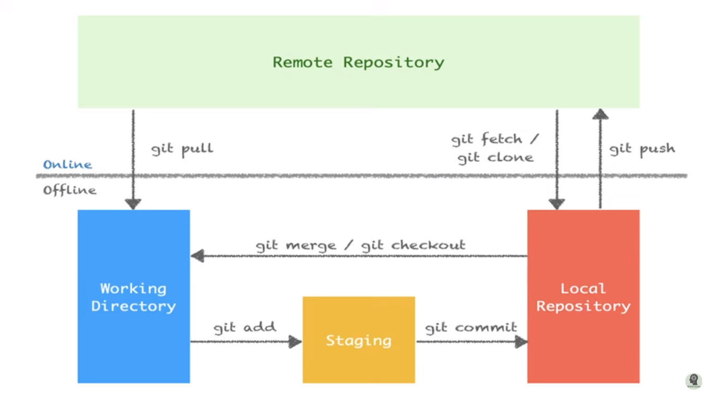

<h2> Git və Github</h2>
<h3> 
Git, pulsuz, açıq mənbəli versiya nəzarət sistemidir. Git mənbə kodundakı dəyişiklikləri izləmək üçün istifadə olunur. 
</h3>
 

<ul len="7268">
    <li len="387">
        <strong len="10" lang="az" style="">git config</strong>
         Ən çox istifadə olunan git əmrlərindən biri
                <strong len="10">də git konfiqurasiyasıdır</strong>. Bu əmrlər
                e-poçt, istifadəçi adı və fayl formatı üçün üstünlük verilən
                alqoritm və s. kimi istifadəçiyə xas konfiqurasiya dəyərlərini
                təyin etmək üçün istifadə edilə bilər. Məsələn, e-poçtun qurulması üçün aşağıdakı əmrdən istifadə
                etmək olar:
            
        <pre class="" len="45">
git config --global user.email sam@google.com</pre
        >;kmjkn
    </li>
    
    <li len="122">
        <strong len="8" lang="az" style="">git init</strong> Bu əmr yeni GIT qovluğu yaratmaq üçün istifadə olunur. Nümunə: 
        <pre class="" len="8">git init</pre>
    </li>
    <li len="237">
        <strong len="7" lang="az" style="">git add</strong> Faylı qovluğa əlavə etmək üçün
                <strong len="7">git</strong> əmrindən istifadə etmək olar. Məsələn, aşağıdakı əmr temp.txt adlı faylı indeksləyəcək və bu
                fayl lokal qovluğa yerləşdirəcək:
            
        <pre class="" len="16">git add temp.txt</pre>
        <pre class="" len="16">git restore --staged ders_2.py</pre>
    </li>
    <li len="384">
        <strong len="10" lang="az" style="">git clone</strong
        > <strong len="9">Git clone</strong> əmri qovluğa nəzarət məqsədi ilə
            istifadə olunur. Əgər cərgə uzaq serverdə yerləşirsə:
        
<pre class="" len="48">
git clone alex@93.188.160.58:/path/to/repository
git clone https://github.com/Ferid612/Lessons
</pre
        >
        

            Əks halda:
        

        <pre class="" len="29">git clone /path/to/repository</pre>
    </li>
    <li len="266">
        <strong len="10" lang="az" style="">git commit</strong
        > Başlığa edilən dəyişiklikləri tətbiq etmək üçün
                <strong len="10">git commit</strong> əmrindən istifadə olunur. Qeyd edək ki, edilən dəyişikliklər uzaq uzaq qovluğa yəni reporya getməyəcəkdir. istifadə et: 
        <pre class="" len="42">git commit –m “commit mesajı”</pre>
    </li>
    <li len="214">
        <strong len="10" lang="az" style="">git status</strong> <strong len="10">Git status</strong> əmri hələ əlavə olunmamış
                və ya edilməmiş fayllarla birlikdə dəyişdirilmiş faylların
                siyahısını göstərir. istifadə et: 
        <pre class="" len="10">git status</pre>
    </li>
    <li len="269">
        <strong len="8" lang="az">git push</strong> <strong len="8">git push</strong> ən çox istifadə olunan əsas
                Git əmrlərindən biridir. Push əmri ilə o, local branch ilə əlaqəli olan uzaq branchın 
                əsas filialına edilən dəyişiklikləri ötürür. Məsələn: 
        <strong>Öncəsind:</strong>
        <pre>git remote add origin https://github.com/Ferid612/For-Testing.git </pre>
        <pre class="" len="22">git push origin master</pre>
        <strong>və ya:</strong>
        <pre class="" len="22">git push -u origin Farid612</pre>
    </li>
    <li len="321">
        <strong len="12" lang="az">git checkout</strong> <strong len="12">Git checkout</strong> əmri filiallar arasında
                yaratmaq və ya keçmək üçün istifadə olunur. Məsələn, aşağıdakılar yeni filial yaradır və ona keçid edir:
            
        <pre class="" len="23">command git checkout -b</pre>
        

            Bir budaqdan digərinə keçmək üçün istifadə edin:
        

        <pre class="" len="12">git checkout</pre>
    </li>
    <li len="339">
        <strong len="10" lang="az">git remote</strong> <strong len="10">Git</strong> remote əmri istifadəçiyə uzaq
                qovğaya bağlanmağa imkan verir. Aşağıdakı əmr hazırda konfiqurasiya edilmiş uzaq cərgələri
                sadalayır:
            
        <pre class="" len="13">git remote –v</pre>
        

            Bu əmr də öz növbəsində istifadəçiyə lokal qovluğu uzaq qovluğa
            bağlamağa imkan yaradır:
        

        <pre class="" len="21">git remote add origin Farid612</pre>
    </li>
    <li len="292">
        <strong len="10" lang="az" style="">git branch</strong> <strong len="10">Git branch</strong> əmrindən branch`ların
                siyahısının yaradılması və ya silinməsi üçün istifadə etmək
                olar. Repoda mövcud olan bütün filialları sadalamaq üçün
                aşağıdakılardan istifadə edin:
            
        <pre class="" len="10">git branch</pre>
        
Branchı silmək üçün:

        <pre class="" len="13">git branch -d Farid613</pre>
        <pre class="" len="13">git branch -D Farid613</pre>
    </li>
    <li len="174">
        <strong len="8" lang="az" style="">git pul</strong> Pull əmri uzaq qovluqda edilən bütün dəyişiklikləri yerli iş
                qovluğuna birləşdirmək üçün istifadə olunur. istifadə et: 
        <pre class="" len="8">git pull</pre>
    </li>
    <li len="156">
        <strong len="9" lang="az">git merge</strong> Bir branch'i
                <strong len="9">başqa bir brancha birləşdirmək</strong> üçün git merge
                əmrindən istifadə olunur.  
        <pre class="" len="9">git merge</pre>
    </li>
    <li len="405">
        <strong len="8" lang="az" style="">git diff</strong> Çatışmazlıqları sadalamaq üçün
                <strong len="8">git diff</strong> əmrindən istifadə olunur. Baza faylı ilə ziddiyyətlərə baxmaq üçün
            
        <pre class="" len="15">git diff --base</pre>
        

            Birləşmədən əvvəl birləşdiriləcək budaqlar arasındakı konfliktlərə
            baxmaq üçün aşağıdakı əmrdən istifadə olunur:
        

        <pre class="" len="8">git diff</pre>
        

            Mövcud münaqişələrin siyahısını bilmək üçün, sadəcə olaraq:
        

        <pre class="" len="8">git diff</pre>
    </li>
    <li len="155">
        <strong len="7" lang="az">git tag</strong> Tagging - konkret öhdəlikləri sadə hissələrə işarə etmək üçün
                istifadə olunur. Buna misal olaraq: 
        <pre class="" len="13">git tag 1.1.0</pre>
    </li>
    <li len="295">
        <strong len="7" lang="az">git log</strong> <strong len="7">Git log</strong> əmrini işə salaraq müvafiq
                detallara malik olan filialda commits siyahısını çıxarır. Nümunə buraxılışı: 
        <pre class="" len="106">
commit 15f4b6c44b3c8344caasdac9e4be13246e21sadw Author: Alex Hunter  Date:   Mon Oct 1 12:56:29 2016 -0600</pre
        >
    </li>
    <li len="196">
        <strong len="9" lang="az">git reset</strong> Cərgəni və iş cərgəsini sonuncu cərgəyə sıfırlamaq üçün
                <strong len="9">get reset</strong> əmri istifadə olunur. istifadə et: 
        <pre class="" len="21">git reset --hard HEAD</pre>
    </li>
    <li len="175">
        <strong len="6" lang="az">git rm</strong> Faylı cərgədən və cərgədən çıxarmaq üçün
                <strong len="6">Git RM</strong> istifadə edilə bilər. istifadə et: 
        <pre class="" len="19">git rm filename.txt</pre>
        <pre class="" len="19">git rm tester.py  -f</pre>
    </li>
    <li len="205">
        <strong len="9" lang="az">git stash</strong> Çox güman ki, bu daha az bilinən əsas git əmrlərindən biridir. Dərhal işlənməyəcək dəyişiklikləri müvəqqəti olaraq xilas
                etməyə kömək edir. istifadə et: 
        <pre class="" len="9">git stash</pre>
    </li>
    <li len="170">
        <strong len="8" lang="az">git show</strong> Hər hansı bir git <strong len="8">cismini</strong> haqqında
                mə'lumata baxmaq üçün git show əmrini istifadə edin. Məsələn: 
        <pre class="" len="8">git show</pre>
    </li>
    <li len="219">
        <strong len="9" lang="az" style="">git fetch</strong> Git <strong len="9">Feth</strong> istifadəçiyə bu obyektləri
                hazırda yerli cərgədə olmayan uzaq cərgədən əldə etməyə imkan
                verir. Nümunə istifadə qaydası: 
        <pre class="" len="16">git fetch origin</pre>
    </li>
    <li len="225">
        <strong len="11" lang="az">git Is-tree</strong> Ağac obyektinə, hər bir əşyanın ad və rejiminə və blob-un SHA-1
                qiymətinə baxmaq üçün
                <strong len="11">git ls-tree</strong> əmrindən istifadə edin. Məsələn: 
        <pre class="" len="16">git ls-tree HEAD</pre>
    </li>
    <li len="220">
        <strong len="11" lang="az">git catfile</strong> SHA-1 qiyməti ilə
                <strong len="12">git cat-file</strong> əmrindən istifadə edərək
                obyektin tipini nümayiş etdir. Məsələn: 
        <pre class="" len="56">
git cat-file –p d670460b4b4aece5915caf5c68d12f560a9fe3e4</pre
        >
    </li>
    <li len="271">
        <strong len="8" lang="az">git grep</strong> <strong len="8">Git Grep</strong> istifadəçilərə məzmun
                ağacları vasitəsilə cümlə və/və ya sözləri tapmağa imkan verir. Məsələn, bütün fayllarda
                <em len="17">www.hostinger.com</em> axtarmaq üçün
                aşağıdakılardan istifadə olunur:
            
        <pre class="" len="28">git grep "www.hostinger.com"</pre>
    </li>
    <li len="121">
        <strong len="4" lang="az">git</strong> <strong len="4">Gitk</strong> əmri yerli cərgə üçün qrafik
            interfeysdir.
        
        <pre class="" len="4">gitk</pre>
    </li>
    <li len="252">
        <strong len="12" lang="az">git instaweb</strong> Git <strong len="12">instaweb</strong> əmri ilə interface-də
                yerli repository ilə web server işlənə bilər. Veb-brauzer də avtomatik olaraq ona istiqamətləndirilir. Məsələn: 
        <pre class="" len="27">git instaweb –httpd=webrick</pre>
    </li>
    <li len="156">
        <strong len="6" lang="az">git gc</strong> Zibil fayllarını təmizləyərək reyestri optimallaşdırmaq üçün, zibil
            yığımı vasitəsilə aşağıdakılardan istifadə edin:
        
        <pre class="" len="6">git gc</pre>
    </li>
    <li len="237">
        <strong len="11" lang="az">git archive</strong> <strong len="11">Git arxivi</strong> əmri istifadəçiyə bir
                cərgə ağacının komponentlərini ehtiva edən zip və ya tar faylı
                yaratmağa imkan verir. Məsələn: 
        <pre class="" len="31">git archive --format=tar master</pre>
    </li>
    <li len="172">
        <strong len="9" lang="az">git prune</strong> <strong len="9">Git buune</strong> əmri vasitəsilə gələn
                işarələri olmayan obyektlər silinir. istifadə et: 
        <pre class="" len="9">git prune</pre>
    </li>
    <li len="182">
        <strong len="8" lang="az">git fsck</strong> Git fayl sisteminin bütövlüyünü yoxlamaq üçün
                <strong len="8">git fsck</strong> əmrini istifadə edin. Korlanmış obyektlər müəyyən edilir: 
        <pre class="" len="8">git fsck</pre>
    </li>
    <li len="181">
        <strong len="10" lang="az">git rebase</strong> <strong len="10">Git rebase</strong> əmri başqa bir filialda
                öhdəlikləri yenidən tətbiq etmək üçün istifadə olunur. Məsələn: 
        <pre class="" len="17">git rebase master</pre>
    </li>
</ul>
