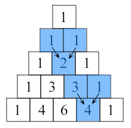

12. Write a Python function that checks whether a passed string is a palindrome or not.
Note: A palindrome is a word, phrase, or sequence that reads the same backward as forward, e.g., madam or nurses run.

 
 

13. Write a Python function that prints out the first n rows of Pascal's triangle.
Note : Pascal's triangle is an arithmetic and geometric figure first imagined by Blaise Pascal.

Sample Pascal's triangle :

Pascal's triangle

Each number is the two numbers above it added together

https://www.w3resource.com/python-exercises/python-functions-exercise-13.php

14. Write a Python function to check whether a string is a pangram or not.
Note : Pangrams are words or sentences containing every letter of the alphabet at least once.
For example : "The quick brown fox jumps over the lazy dog"
Click me to see the sample solution

